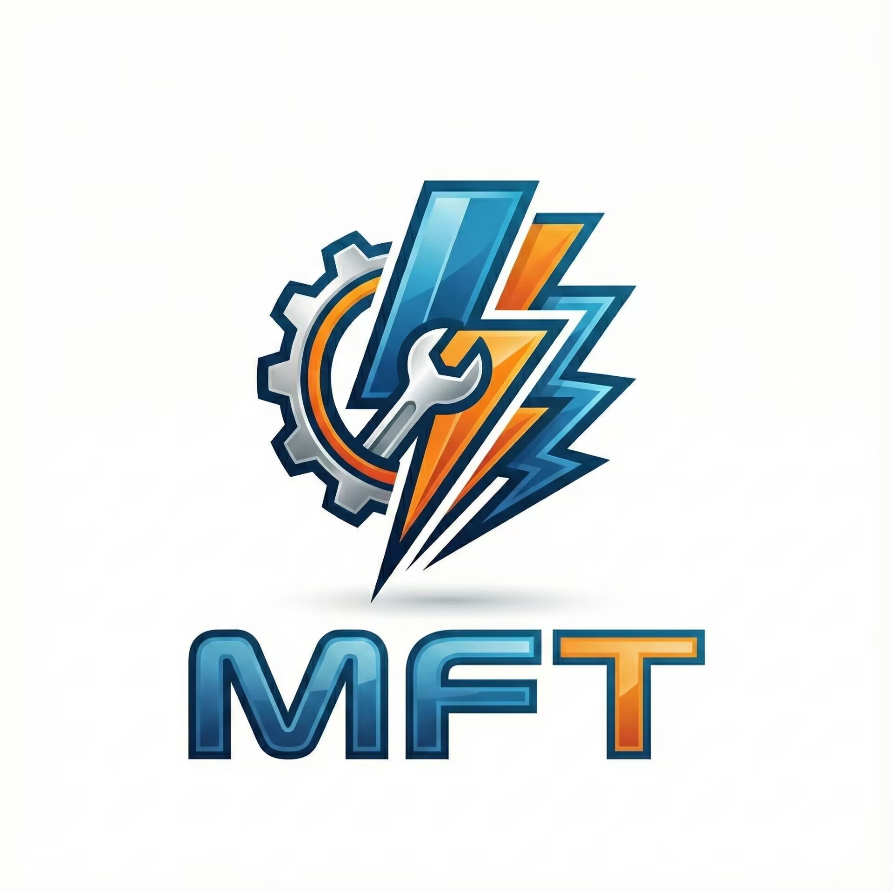

<div align="center">
  
  
  # MultiFlash Tool
  
  **一款开源的多功能安卓刷机工具**
  
  支持高通 EDL (9008) 模式和 Fastboot 模式
  
  [](LICENSE)
  [](https://dotnet.microsoft.com/)
  [](https://www.microsoft.com/windows)
  [](https://github.com/xiriovo/MultiFlash-Tool/stargazers)
  [](https://github.com/xiriovo/MultiFlash-Tool/network/members)
  
  [](https://github.com/xiriovo/MultiFlash-Tool/issues)
  [](https://github.com/xiriovo/MultiFlash-Tool/pulls)
  [](https://github.com/xiriovo/MultiFlash-Tool/releases)
  [](https://github.com/xiriovo/MultiFlash-Tool/releases)
  
  中文文档 | [English](README_EN.md) | [快速参考](docs/QUICK_REFERENCE.md)
  
</div>

---

## 📑 目录

- [许可声明](#许可声明)
- [功能特性](#功能特性)
- [系统要求](#系统要求)
- [快速开始](#快速开始)
- [文档](#文档)
- [技术栈](#技术栈)
- [常见问题](#常见问题)
- [贡献](#贡献)
- [许可证](#许可证)
- [联系方式](#联系方式)

## 🎯 项目亮点

<table>
  <tr>
    <td align="center">
      <br>
      <b>高效稳定</b><br>
      优化的刷写算法<br>支持断点续传
    </td>
    <td align="center">
      <br>
      <b>简单易用</b><br>
      图形化界面<br>一键操作
    </td>
    <td align="center">
      <br>
      <b>功能全面</b><br>
      EDL + Fastboot<br>固件工具集
    </td>
    <td align="center">
      <br>
      <b>开源免费</b><br>
      完全开源<br>持续更新
    </td>
  </tr>
</table>

## ⚠️ 许可声明

本项目采用 **非商业许可**，**禁止任何形式的商业用途**。

- ❌ 禁止出售
- ❌ 禁止商业产品使用
- ❌ 禁止用于盈利目的
- ✅ 自由学习和研究
- ✅ 可修改和分发（需保持相同限制）

## ✨ 功能特性

### 核心功能

- 📱 **智能设备检测**
  - 自动识别 ADB/Fastboot/EDL 设备
  - 实时设备状态监控
  - 多设备同时管理

- 🔧 **EDL 模式刷写**
  - 支持高通 9008 模式刷机
  - Sahara 协议通信
  - Firehose 协议刷写
  - GPT 分区表备份/恢复
  - 内存读写操作

- ⚡ **Fastboot 增强**
  - 分区读写操作
  - OEM 解锁/重锁
  - 设备信息查询
  - 自定义命令执行

- 📦 **固件工具**
  - Payload.bin 提取
  - Super 分区合并
  - 稀疏镜像处理
  - 分区镜像提取

### 高级特性

- 🔐 **安全认证** - 云端授权验证
- 📝 **详细日志** - 操作日志记录与导出
- 🌐 **多语言支持** - 中文界面
- 🎨 **现代 UI** - 基于 AntdUI 框架

## 📋 系统要求

### 最低配置
- **操作系统**: Windows 10 (64-bit) 或更高版本
- **运行时**: .NET Framework 4.8 或更高版本
- **内存**: 4GB RAM
- **存储**: 500MB 可用空间

### 驱动要求
- **高通 EDL 驱动**: 用于 9008 模式（必需）
- **ADB 驱动**: 用于 ADB 调试
- **Fastboot 驱动**: 用于 Fastboot 模式

## 🚀 快速开始

### 安装步骤

1. **下载程序**
   - 从 [Releases](../../releases) 页面下载最新版本
   - 解压到任意目录（建议英文路径）

2. **安装驱动**
   - 安装高通 EDL 驱动（9008 模式）
   - 安装 ADB 和 Fastboot 驱动

3. **运行程序**
   ```
   MultiFlash Tool.exe
   ```

4. **连接设备**
   - 通过 USB 连接设备
   - 程序会自动检测设备类型
   - 选择对应的操作模式

### 使用示例

#### EDL 模式刷机
1. 设备进入 9008 模式
2. 选择 Programmer 文件（.mbn/.elf）
3. 选择固件包或分区镜像
4. 点击"开始刷写"

#### Fastboot 操作
1. 设备进入 Fastboot 模式
2. 选择要操作的分区
3. 执行读取/写入/擦除操作

#### Payload 提取
1. 选择 OTA 包（.zip）
2. 选择输出目录
3. 点击"提取 Payload"

## 📚 文档

### 核心文档
- **[快速参考指南](docs/QUICK_REFERENCE.md)** ⭐ - 常用操作速查手册
- **[开发指南](DEVELOPMENT.md)** - 项目结构和开发规范
- **[贡献指南](CONTRIBUTING.md)** - 如何参与项目贡献
- **[更新日志](CHANGELOG.md)** - 版本更新记录

### 辅助文档
- **[联系方式配置](docs/CONTACT_INFO.md)** - 所有联系渠道
- **[截图和演示](docs/SCREENSHOTS.md)** - 界面预览和视频教程
- **[文档改进记录](docs/DOCUMENTATION_IMPROVEMENTS.md)** - 文档完善历史

## 🤝 贡献

欢迎提交 Issue 和 Pull Request！

### 如何贡献
1. Fork 本仓库
2. 创建特性分支 (`git checkout -b feature/AmazingFeature`)
3. 提交更改 (`git commit -m 'Add: 添加某个功能'`)
4. 推送到分支 (`git push origin feature/AmazingFeature`)
5. 提交 Pull Request

详见 [CONTRIBUTING.md](CONTRIBUTING.md) 了解完整的贡献指南。

## 🛠️ 技术栈

- **UI 框架**: [AntdUI](https://gitee.com/antdui/AntdUI) 2.2.1
- **压缩库**: SharpZipLib 1.4.2
- **JSON**: System.Text.Json 8.0.5 / Newtonsoft.Json 13.0.4
- **Protobuf**: Google.Protobuf 3.17.3
- **加密**: Fody / Costura

## ❓ 常见问题

### 设备无法识别？
- 检查驱动是否正确安装
- 尝试更换 USB 端口
- 确认设备已进入对应模式

### EDL 模式刷写失败？
- 确认 Programmer 文件与设备匹配
- 检查固件包完整性
- 查看日志文件排查错误

### 提示权限不足？
- 以管理员身份运行程序
- 检查杀毒软件是否拦截

## ⚠️ 免责声明

**使用本工具存在风险，可能导致设备变砖或数据丢失。**

- ⚠️ 操作前请务必备份重要数据
- ⚠️ 确保了解刷机操作的风险
- ⚠️ 不当操作可能导致设备无法启动
- ⚠️ 本工具仅供学习和研究目的

**开发者不对任何因使用本工具造成的损失负责。**

## 📄 许可证

本项目采用 **非商业许可证** - 详见 [LICENSE](LICENSE) 文件

- ✅ 允许个人学习和研究使用
- ✅ 允许修改和分发（需保持相同许可）
- ❌ 禁止任何形式的商业用途
- ❌ 禁止出售或用于盈利

## 🌟 Star History

如果这个项目对你有帮助，请给个 Star ⭐

## 📧 联系方式

### 问题反馈
- **Bug 报告**: [GitHub Issues](../../issues/new?template=bug_report.md)
- **功能建议**: [GitHub Issues](../../issues/new?template=feature_request.md)
- **问题讨论**: [GitHub Discussions](../../discussions)

### 社区交流
- **QQ 群**: [MultiFlash TOOL](https://qm.qq.com/q/oCwGmTm5a2)
- **Telegram**: [OPFlashTool](https://t.me/OPFlashTool)
- **Discord**: [加入服务器](https://discord.gg/your-invite) <!-- 请替换为实际的 Discord 链接 -->

### 开发者联系
- **项目维护者**: 
  - [@xiriovo](https://github.com/xiriovo)
  - [@Love-suannai](https://github.com/Love-suannai)
- **邮箱**: 1708298587@qq.com

### 关注我们
- **GitHub**: [Star 本项目](https://github.com/xiriovo/MultiFlash-Tool)
- **Gitee 镜像**: [国内镜像](https://gitee.com/xiriovo/MultiFlash-Tool) <!-- 如有镜像请取消注释 -->

> 💡 **提示**: 提问前请先查看 [常见问题](#常见问题) 和 [已有 Issues](../../issues)

---

<div align="center">
  Made with ❤️ by MultiFlash Tool Team
  <br>
  Copyright © 2024 MultiFlash Tool. All rights reserved.
</div>
